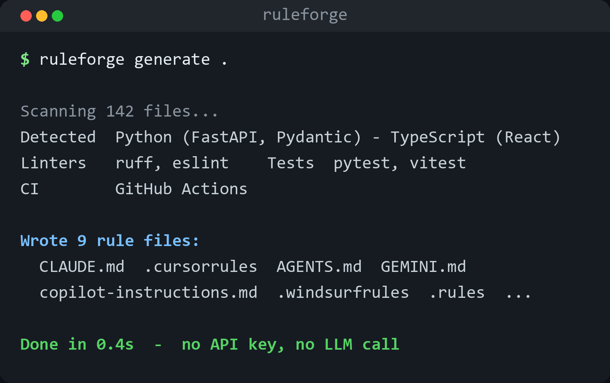

<div align="center">


[](https://pypi.org/project/ruleforge/)
[](https://github.com/he-yufeng/RuleForge/actions)
[](LICENSE)

[**快速开始**](#快速开始) · [**检测能力**](#检测能力) · [**输出示例**](#输出示例) · [English](README.md)

</div>

<p align="center"></p>

RuleForge 扫描你的项目——编程语言、框架、lint 工具、测试配置、CI 设置——然后自动生成可直接使用的规则文件，支持 **Claude Code**（`CLAUDE.md`）、**Cursor**（`.cursorrules`）、**GitHub Copilot**（`.github/copilot-instructions.md`）、工具无关的 **`AGENTS.md`** 约定、**Windsurf**（`.windsurfrules`）、**Cline**（`.clinerules`）、**Gemini CLI**（`GEMINI.md`）、**Zed**（`.rules`）和 **Aider**（`CONVENTIONS.md`）。

别再手写这些文件了，让你的代码库自己说话。

## 为什么需要？

AI 编程助手在有项目上下文时效果会好很多。但大多数开发者要么：

- 根本不写规则文件（白白浪费性能）
- 复制粘贴通用模板，跟实际技术栈完全不匹配
- 花 30 分钟手写一份，然后再也不更新

RuleForge 通过真正读取你的项目配置，几秒钟生成准确的、贴合技术栈的规则。

## 检测能力

| 类别 | 示例 |
|------|------|
| **编程语言** | Python、TypeScript、JavaScript、Go、Rust、Java、C++ 等 20+ 种 |
| **框架** | FastAPI、Flask、Django、React、Next.js、Vue、Svelte、Express、Gin、Axum... |
| **包管理器** | pip、poetry、hatch、pnpm、yarn、bun、npm、cargo |
| **Lint 和格式化** | ruff、black、eslint、prettier、biome、clippy、go fmt |
| **测试框架** | pytest、unittest、vitest、jest、mocha |
| **CI 系统** | GitHub Actions、GitLab CI、CircleCI、Jenkins |
| **项目命令** | package scripts、Python CLI 入口，以及 GitHub Actions 真正执行的验证命令 |
| **其他** | Docker、Makefile、monorepo 结构、入口文件、.gitignore 模式 |

## 安装

```bash
pip install ruleforge
```

## 快速开始

```bash
# 扫描项目，查看检测结果
ruleforge scan .

# 生成所有规则文件（CLAUDE.md、.cursorrules、copilot-instructions）
ruleforge generate .

# 只生成 CLAUDE.md
ruleforge generate . -f claude

# 预览，不写文件
ruleforge preview .

# 审计已有规则文件是否缺关键信息
ruleforge audit .

# 在 CI 里要求规则质量至少 80 分
ruleforge audit . --min-score 80

# 检查已有规则里的占位符、冲突和过时建议
ruleforge lint .

# 覆盖已有文件
ruleforge generate . --overwrite

# 输出到其他目录
ruleforge generate . -o /tmp/rules
```

## 输出示例

对一个 FastAPI 项目运行 `ruleforge generate` 会生成类似这样的 `CLAUDE.md`：

```markdown
# my-api

This is a Python project.
Key frameworks: FastAPI, Pydantic, SQLAlchemy.

## Project Structure

Source directories: `src/`, `tests/`
Entry points: `main.py`
Package manager: poetry

## Coding Conventions

- Linter: ruff
- Formatter: ruff
- Testing: pytest
- Python: >=3.11
- CI: GitHub Actions

## Project Commands

- `npm run test`: `vitest run`
- `npm run lint`: `eslint .`

## Guidelines

- Use type hints for function signatures.
- Run `ruff check` and `ruff format` before committing.
- Write tests with pytest. Put test files in the `tests/` directory.
- Use Pydantic models for request/response schemas.
- The project uses Docker. Keep Dockerfile up to date with dependencies.

## Do NOT

- Do not modify generated files or lock files manually.
- Do not add dependencies without mentioning it.
- Do not change the project structure without asking first.
- Do not skip CI checks or disable linting rules.
- Do not commit files matching gitignore patterns.
```

## 支持的输出格式

| 格式 | 文件 | 使用者 |
|------|------|--------|
| `claude` | `CLAUDE.md` | Claude Code、Claude Desktop |
| `cursor` | `.cursorrules` | Cursor IDE |
| `copilot` | `.github/copilot-instructions.md` | GitHub Copilot |
| `agents` | `AGENTS.md` | 任何读取 `AGENTS.md` 的工具无关 agent |
| `windsurf` | `.windsurfrules` | Windsurf / Codeium |
| `cline` | `.clinerules` | Cline |
| `gemini` | `GEMINI.md` | Gemini CLI |
| `zed` | `.rules` | Zed（读取项目根的 `.rules` 文件） |
| `aider` | `CONVENTIONS.md` | Aider（在 `.aider.conf.yml` 里 `read: CONVENTIONS.md`） |

`ruleforge generate --format all` 会一次写全部九种；多次传 `--format`（如 `--format agents --format cursor`）可只选其中几种。

## 规则审计

RuleForge 现在也可以检查你已经写好的规则文件。它会看这些文件是否包含真实项目里最关键的几类信息：

- 项目背景和技术栈
- 明确的测试、lint、typecheck、build 命令
- 从 GitHub Actions `run` 步骤提取的真实验证命令（会跳过引用 secret 的命令）
- 编辑边界和 generated file 提醒
- secret / token / `.env` 处理规则
- git、PR、CI、review 工作流
- 对 AI assistant 行为方式的约束

```bash
ruleforge audit .
ruleforge audit . --format json
ruleforge audit . --format sarif > ruleforge.sarif
ruleforge audit . --min-score 80
```

这适合放进 CI，也适合检查手写的 `AGENTS.md`、`CLAUDE.md`、`.cursorrules` 或 Copilot instructions 是否足够具体。SARIF 输出会把缺失的规则变成 GitHub Code Scanning 告警。RuleForge 生成新规则时也会标出项目里已有的 assistant 规则文件，避免生成稿无意覆盖更严格的本地约束。

## 规则 Lint

`audit` 衡量规则文件覆盖了多少内容，`lint` 则找其中**写错或没法用**的指引——那种会悄悄把 agent 带偏的东西：

- 没填的模板占位符（`TODO`、`FIXME`、`{{ ... }}`、`<your project name>`）
- 互相冲突的指令，比如同时推荐 `npm` 和 `pnpm`、`pytest` 和 `unittest`，或 `black` 和 `ruff`
- 过时的建议，比如仓库已经是 `pnpm-lock.yaml` 还让用 `yarn`，或项目已切到 `ruff` 还让用 `black` 格式化

```bash
ruleforge lint .
ruleforge lint . --format json
ruleforge lint . --strict   # 把 warning 也当成错误
```

占位符报为 error，工具冲突或过时报为 warning。冲突和过时检查覆盖包管理器、测试框架、linter 和 formatter。命令在有 error（`--strict` 下任意 warning）时退出非零，可直接放进 CI 步骤。冲突和过时检查只比较同一生态内的工具，所以同时真用 `pytest` 和 `jest`、或 `ruff` 和 `eslint` 的多语言仓库不会被误报。

## Python API

```python
from ruleforge import analyze_project, generate_rules
from ruleforge.generator import write_rules

# 分析项目
profile = analyze_project("./my-project")
print(profile.languages)    # {'Python': 42, 'TypeScript': 15}
print(profile.frameworks)   # ['FastAPI', 'React']

# 生成规则
rules = generate_rules(profile, formats=["claude", "cursor"])
for rule in rules:
    print(rule.filename, len(rule.content))

# 写入文件
write_rules(rules, "./my-project")
```

## 局限性

- 检测基于配置文件和文件扩展名，不做代码语义分析
- 生成的规则是一个不错的起点，但不是最终版本。建议根据项目的具体约定进行审查和定制
- 框架检测依赖于依赖声明（pyproject.toml、package.json 等）

## 后续规划

「检测 + 生成」这条主线已经稳定，接下来主要是逐条补上面的局限性：

- **轻量代码语义检测**：采样几个有代表性的源文件来识别命名和布局约定，而不是只靠配置文件和扩展名推断。
- **更多助手格式**：在 CLAUDE.md / `.cursorrules` / Copilot 之外，再生成 Windsurf、Cline、Zed 的规则文件；生成器已经把内容和格式分开，每个新目标基本只是一份模板。
- **漂移检测**：一个 `ruleforge check`，当已提交的规则落后于项目（新命令、结构挪动）时给出提示，别让规则文件悄悄过时。
- **monorepo 分包规则**：识别 workspace，按包生成各自作用域的规则文件，而不只是仓库根目录一套。

## 参与贡献

欢迎贡献！特别是以下方面：

- 新增语言/框架检测（见 `analyzer.py`）
- 改进规则模板（见 `generator.py`）
- 支持更多 AI 助手格式

```bash
git clone https://github.com/he-yufeng/RuleForge.git
cd RuleForge
pip install -e ".[dev]"
pytest
```

## 相关项目

RuleForge 是我同时维护一堆仓库时做出来的，下面几个出自同一摊活：

- **[CoreCoder](https://github.com/he-yufeng/CoreCoder)** — 想搞懂一个 coding agent 到底怎么运作？把整套约 1000 行引擎从头读到尾，而不是当黑箱。
- **[RepoWiki](https://github.com/he-yufeng/RepoWiki)** — 被丢进一个陌生代码库？它给你一份带「从哪读起」路径的 wiki，一个可自托管的 DeepWiki 替代。
- **[GitSense](https://github.com/he-yufeng/GitSense)** — 想给开源做贡献？它帮你找到值得做的 issue，还能估你的 PR 多大概率被合。
- **[CodeABC](https://github.com/he-yufeng/CodeABC)** — 不会写代码也能看懂一个项目，专给小白做的。

## 许可证

MIT
